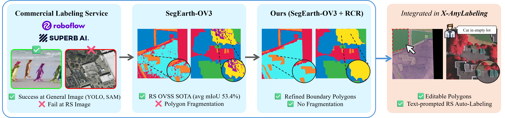
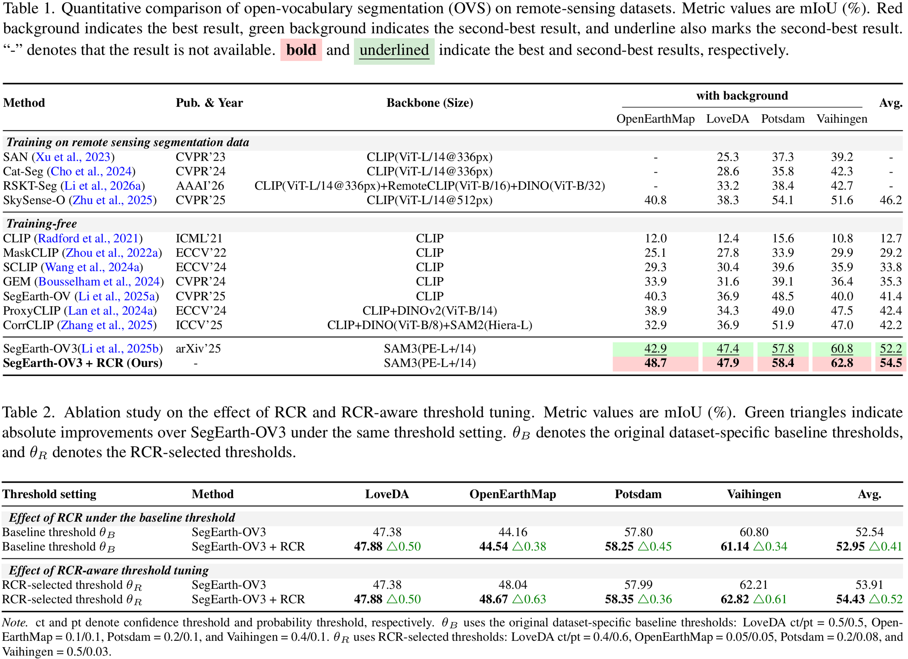

<div align="center">

# RS-AutoLabel

**Training-Free Open-Vocabulary Remote Sensing Auto-Labeling**
**with Region Consistency Refinement and User-Assisted Exemplar Prompting**

_Capstone Design Project (2026)_

</div>

---

## Motivation

<p align="center"></p>

Commercial labeling tools succeed on natural images but fail on **remote-sensing imagery** — they assume common-object categories and have no open-vocabulary reasoning. **SegEarth-OV3** brings OVSS to remote sensing, but its raw outputs suffer from polygon **fragmentation**, **boundary noise**, and unstable small-component predictions. RS-AutoLabel closes this gap with two contributions:

1. **Region Consistency Refinement (RCR)** — a training-free, five-stage post-processor that cleans the baseline output.
2. **X-AnyLabeling integration** — turning OVSS into a usable interactive labeling system for novel open-world remote-sensing categories.

---

## Highlights

- 🛰 **Training-free RCR refinement** — TTA consensus + boundary / local-vote / component cleanup + safety cap, on top of frozen SegEarth-OV3 + SAM 3. No fine-tuning, no extra weights.
- 🖱 **X-AnyLabeling integration** — SAM 3 native text / box / point prompts, on-the-fly novel-class registration, editable vector polygons as the deliverable.
- 📈 **Consistent gains over the SegEarth-OV3 baseline** — lifts average **mIoU to 54.5 %** (+2.3 over baseline) on LoveDA, OpenEarthMap, Potsdam, Vaihingen.
- 🧩 **Self-contained module** — the [`rcr/`](SegEarth-OV-3/rcr/) package drops into any SegEarth-OV3 variant without retraining; reuses base-model evidence only.

---

## Method

<p align="center"></p>

### Stage 1 — Frozen baseline evidence
SegEarth-OV3 + SAM 3 produces semantic logits, instance logits, and a per-class presence score. The class logit is extracted as
`max(instance · object_score, semantic) · presence`.

### Stage 2 — TTA consensus
Re-run inference under `hflip / rot90 / rot180 / rot270` views, inverse-transform each view's logits back to the original frame, and form the consensus `fused = (1−w)·raw + w·mean(views)` with `w = fuse_weight`.

### Stage 3 — Region cues
Refine pixels that are jointly (a) boundary or low-margin, (b) not high-confidence locked, (c) supported by consensus or semantic–instance dense-head agreement, and (d) by a local majority vote within a small window. Small connected components below `min_area` are absorbed into their dominant neighbor.

### Stage 4 — Safety cap
Compare the refined mask against the raw mask. If the global changed-pixel ratio exceeds `safety.max_total_changed_ratio`, keep only the top-k changes by logit gain and revert the rest.

### Stage 5 — Final mask
Argmax with `prob_thd` background fallback. The refinement is per-image and deterministic — no retraining, no extra weights.

> Full algorithm spec: [`SegEarth-OV-3/docs/RCR_SEG_EARTH_PROPOSED.md`](SegEarth-OV-3/docs/RCR_SEG_EARTH_PROPOSED.md).

---

## Installation

### 1) Clone
```bash
git clone --recursive https://github.com/qhdusrla08/capstone-project.git
cd capstone-project
```

### 2) Conda env (reproducing the authors' setup)
```bash
conda create -n segearth_stable python=3.10 -y
conda activate segearth_stable
pip install -r SegEarth-OV-3/env/requirements.segearth_stable.txt
```
> System packages captured in [`SegEarth-OV-3/env/system.segearth_stable.txt`](SegEarth-OV-3/env/system.segearth_stable.txt).

### 3) X-AnyLabeling extras (for the GUI)
```bash
pip install -r X-AnyLabeling/requirements-gpu.txt
```

### 4) SAM 3 weights
Place the SAM 3 checkpoint at `SegEarth-OV-3/weights/sam3/sam3.pt`. See [`SegEarth-OV-3/scripts/download_sam3.py`](SegEarth-OV-3/scripts/download_sam3.py).

---

## Quick Start

### A. Single-image OVSS + RCR (one PNG out)
```bash
cd SegEarth-OV-3
python scripts/single_image_rcr.py \
  --image resources/oem_koeln_50.tif \
  --classes background "bareland,barren" grass road "tree,forest" \
            "water,river" cropland "building,roof,house" \
  --show building \
  --out outputs/demo_building_only.png \
  --rcr-config configs/rcr_openearthmap.yaml
```
Outputs `outputs/demo_building_only.png` — only the `building` class is overlaid on top of the input.

### B. Reproduce the 4-dataset evaluation
```bash
cd SegEarth-OV-3
CUDA_VISIBLE_DEVICES=0 python eval.py configs/cfg_loveda_rcr.py        --out outputs/rcr_loveda_eval/full
CUDA_VISIBLE_DEVICES=1 python eval.py configs/cfg_openearthmap_rcr.py  --out outputs/rcr_openearthmap_eval/full
CUDA_VISIBLE_DEVICES=2 python eval.py configs/cfg_potsdam_rcr.py       --out outputs/rcr_potsdam_eval/full
CUDA_VISIBLE_DEVICES=3 python eval.py configs/cfg_vaihingen_rcr.py     --out outputs/rcr_vaihingen_eval/full
```
Each run writes class-wise IoU to `<out>/class_iou_results.csv` and a summary JSON. Threshold sweep utilities live in [`SegEarth-OV-3/tools/collect_best_rcr_threshold.py`](SegEarth-OV-3/tools/collect_best_rcr_threshold.py).

### C. Interactive labeling in X-AnyLabeling
```bash
cd X-AnyLabeling
python -m anylabeling.app
```
In the GUI:
1. Open an image folder (`Ctrl+U`).
2. Select model **"SegEarth-OV-3 (SAM3)"** — model config in [`X-AnyLabeling/anylabeling/configs/auto_labeling/segearthov3.yaml`](X-AnyLabeling/anylabeling/configs/auto_labeling/segearthov3.yaml).
3. Type a class name in `edit_exemplar_class` → click **Add Class** for text-only registration, or toggle **Exemplar (On)** + draw a box/point on the canvas for spatial guidance.
4. Hit **Run** to get refined polygons.

---

## Experiments

<p align="center"></p>

### Table 1 — Quantitative comparison of OVSS on remote-sensing datasets (mIoU, %)

| Method | Pub. & Year | Backbone (Size) | OpenEarthMap | LoveDA | Potsdam | Vaihingen | Avg. |
|---|---|---|---:|---:|---:|---:|---:|
| _Training on remote-sensing segmentation data_ | | | | | | | |
| SAN (Xu et al., 2023)               | CVPR'23  | CLIP(ViT-L/14@336px)                                       |  -   | 25.3 | 37.3 | 39.2 |  -   |
| Cat-Seg (Cho et al., 2024)          | CVPR'24  | CLIP(ViT-L/14@336px)                                       |  -   | 28.6 | 35.8 | 42.3 |  -   |
| RSKT-Seg (Li et al., 2026a)         | AAAI'26  | CLIP(ViT-L/14@336px)+RemoteCLIP(ViT-B/16)+DINO(ViT-B/32)   |  -   | 33.2 | 38.4 | 42.7 |  -   |
| SkySense-O (Zhu et al., 2025)       | CVPR'25  | CLIP(ViT-L/14@512px)                                       | 40.8 | 38.3 | 54.1 | 51.6 | 46.2 |
| _Training-free_ | | | | | | | |
| CLIP (Radford et al., 2021)         | ICML'21 | CLIP                                  | 12.0 | 12.4 | 15.6 | 10.8 | 12.7 |
| MaskCLIP (Zhou et al., 2022a)       | ECCV'22 | CLIP                                  | 25.1 | 27.8 | 33.9 | 29.9 | 29.2 |
| SCLIP (Wang et al., 2024a)          | ECCV'24 | CLIP                                  | 29.3 | 30.4 | 39.6 | 35.9 | 33.8 |
| GEM (Bousselham et al., 2024)       | CVPR'24 | CLIP                                  | 33.9 | 31.6 | 39.1 | 36.4 | 35.3 |
| SegEarth-OV (Li et al., 2025a)      | CVPR'25 | CLIP                                  | 40.3 | 36.9 | 48.5 | 40.0 | 41.4 |
| ProxyCLIP (Lan et al., 2024a)       | ECCV'24 | CLIP+DINOv2(ViT-B/14)                 | 38.9 | 34.3 | 49.0 | 47.5 | 42.4 |
| CorrCLIP (Zhang et al., 2025)       | ICCV'25 | CLIP+DINO(ViT-B/8)+SAM2(Hiera-L)      | 32.9 | 36.9 | 51.9 | 47.0 | 42.2 |
| SegEarth-OV3 (Li et al., 2025b)     | arXiv'25 | SAM3(PE-L+/14)                       | _42.9_ | _47.4_ | _57.8_ | _60.8_ | _52.2_ |
| **SegEarth-OV3 + RCR (Ours)**       | -        | SAM3(PE-L+/14)                       | **48.7** | **47.9** | **58.4** | **62.8** | **54.5** |

> RS-AutoLabel achieves the best average mIoU across all training-free OVSS methods on the four benchmarks, and also outperforms recent _trained_ RS-OVSS methods (SAN, Cat-Seg, RSKT-Seg, SkyScene-O).

### Table 2 — Ablation: effect of RCR and RCR-aware threshold tuning (mIoU, %)

| Threshold Setting | Method | LoveDA | OpenEarthMap | Potsdam | Vaihingen | Avg. |
|---|---|---:|---:|---:|---:|---:|
| _Effect of RCR under the baseline threshold_ | | | | | | |
| Baseline threshold θ_B     | SegEarth-OV3       | 47.38 | 44.16 | 57.80 | 60.80 | 52.54 |
| Baseline threshold θ_B     | SegEarth-OV3 + RCR | **47.88** △0.50 | **44.54** △0.38 | **58.25** △0.45 | **61.14** △0.34 | **52.95** △0.41 |
| _Effect of RCR-aware threshold tuning_ | | | | | | |
| RCR-selected threshold θ_R | SegEarth-OV3       | 47.38 | 48.04 | 57.99 | 62.21 | 53.91 |
| RCR-selected threshold θ_R | SegEarth-OV3 + RCR | **47.88** △0.50 | **48.67** △0.63 | **58.35** △0.36 | **62.82** △0.61 | **54.43** △0.52 |

> RCR yields a consistent **+0.41 mIoU** lift under the original baseline thresholds and **+0.52 mIoU** when the confidence/probability thresholds are co-tuned with RCR. Threshold values used:
> θ_B (baseline-best): LoveDA `ct/pt=0.5/0.5`, OEM `0.1/0.1`, Potsdam `0.2/0.1`, Vaihingen `0.4/0.1`.
> θ_R (RCR-best): LoveDA `0.4/0.6`, OEM `0.05/0.05`, Potsdam `0.2/0.08`, Vaihingen `0.5/0.03`.

---

## Qualitative Results

<p align="center"></p>

Per-dataset comparison: `Input | SegEarth-OV3 | Ours (SegEarth-OV3 + RCR) | Refined Region | Ground Truth`. The **Refined Region** column highlights the pixels RCR changed with respect to the baseline (white = unchanged, red = refined). RCR reduces fragmented regions, suppresses isolated noise components, and improves boundary consistency across all four benchmarks.

---

## RS-AutoLabel System

<p align="center"></p>

The system embeds the RCR-refined model into X-AnyLabeling's annotation loop. The workflow above shows: text-prompted inference for `"rail"` → optional box-exemplar guidance for `"car"` (a novel class outside the dataset taxonomy) → final editable vector polygon export for human inspection.

### Applications
- **On-Demand Novel Object Mapping** — segment new RS objects with text prompts or box exemplars, without task-specific retraining.
- **AI-Assisted Geospatial Annotation** — generate refined editable vector polygons that support efficient expert correction and interactive GIS annotation workflows.
- **Rapid Large-Scale Map Updating** — quickly update geospatial databases and land-cover maps for emerging objects or changing regions.

---

## Project Structure

```text
capstone-project-rcr-segearth/
├── README.md                              # this file
├── LICENSE                                # repository license
├── assets/                                # README figures (Motivation / Method / ...)
├── SegEarth-OV-3/                         # OVSS backbone + RCR module
│   ├── rcr/                               # ★ training-free refinement module
│   │   ├── rcr_inferencer.py              # 5-stage RCR pipeline
│   │   ├── evidence_extractor.py          # base-model evidence + TTA logits
│   │   └── config.py                      # dataclasses for RCR YAML configs
│   ├── configs/
│   │   ├── cfg_{loveda,openearthmap,potsdam,vaihingen}_rcr.py
│   │   └── rcr_{loveda,openearthmap,potsdam,vaihingen,default}.yaml
│   ├── eval.py                            # MMSeg evaluation entry point
│   ├── scripts/single_image_rcr.py        # single-image overlay helper
│   ├── segearthov3_segmentor.py           # MMSeg segmentor with use_rcr flag
│   ├── docs/RCR_SEG_EARTH_PROPOSED.md     # RCR algorithm spec
│   └── env/requirements.segearth_stable.txt
└── X-AnyLabeling/                         # GUI labeling tool (forked)
    └── anylabeling/
        ├── services/auto_labeling/
        │   └── segearthov3.py             # ★ wrapper: prompt-proxy + RCR
        ├── configs/auto_labeling/segearthov3.yaml
        └── views/labeling/widgets/auto_labeling/
            ├── auto_labeling.ui           # 5 new exemplar widgets
            └── auto_labeling.py           # exemplar mode wiring
```
> Datasets (LoveDA, OpenEarthMap, ISPRS Potsdam, ISPRS Vaihingen) are user-provided and gitignored.

---

## Citation

If you find RS-AutoLabel useful in your work, please cite:

```bibtex
@misc{rs-autolabel-2026,
  title  = {RS-AutoLabel: Training-Free Open-Vocabulary Remote Sensing Auto-Labeling
            with Region Consistency Refinement and User-Assisted Exemplar Prompting},
  author = {Yeongmin Jeong and Boyeon Kim},
  year   = {2026},
  note   = {Capstone Design Project},
  howpublished = {\url{https://github.com/qhdusrla08/capstone-project}}
}
```

---

## Acknowledgements

- [SegEarth-OV3](https://github.com/earth-insights/SegEarth-OV-3) — the OVSS backbone we build on.
- [SAM 3](https://github.com/facebookresearch/sam3) — visual encoder and text-concept prompt mechanism.
- [X-AnyLabeling](https://github.com/CVHub520/X-AnyLabeling) — the GUI we extended with exemplar widgets and RCR integration.
- Benchmark dataset authors: [LoveDA](https://github.com/Junjue-Wang/LoveDA), [OpenEarthMap](https://open-earth-map.org/), [ISPRS Potsdam & Vaihingen](https://www.isprs.org/education/benchmarks/UrbanSemLab/Default.aspx).

---

## License

Copyright © 2026 qhdusrla08. **All rights reserved.** This repository is made public solely for portfolio and academic evaluation purposes; see [`LICENSE`](LICENSE) for the full notice.

Upstream components retain their original licenses: SegEarth-OV3, X-AnyLabeling (GPL-3.0), and SAM 3 (Meta Platforms Research License).
